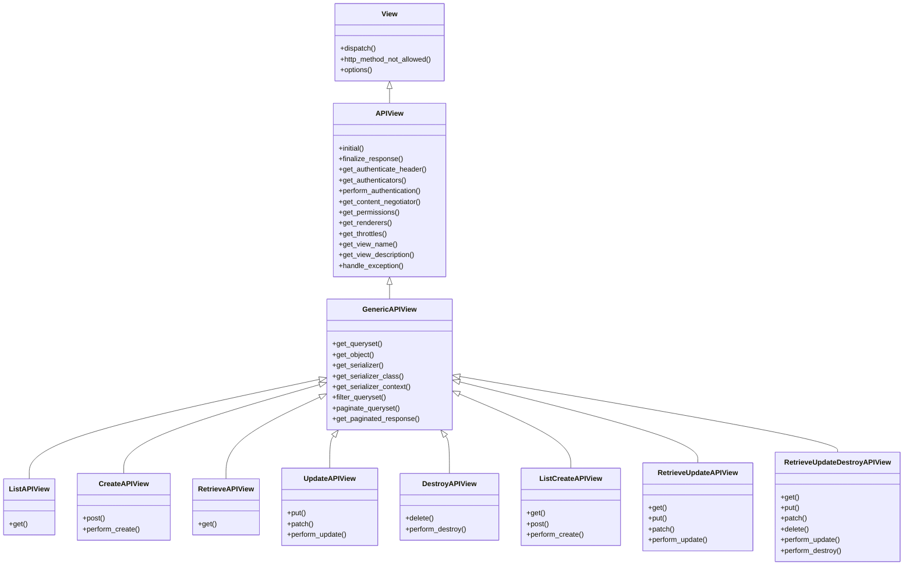

> [!TIP]
> 如果接口是非常标准的list()(get 列表),retrieve()(get 单个资源),destroy()(delete 单个资源)
> update()(put)，partial_update(patch),create(post 单个资源),其中url的设置list和create相同，
> destroy,delete,update,partial_update等需要指定单个资源的url相同,使用viewset类将会非常方便，
> viewset面向的是上面6种动作，APIView面向的是HTTP请求，现成的LISTAPIView等APIView由mixin和
> genericAPIView继承而来，意味着可以自定义根据此url对应的请求使用不同类的mixin来构建自己的
> genericAPIView
